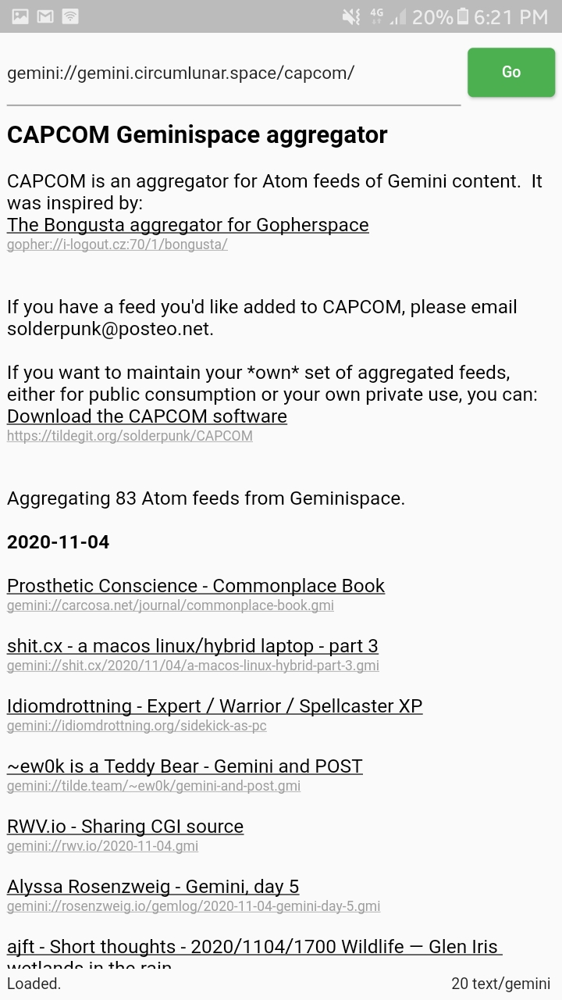

# Gemila

A Gemini browser written in Flutter for Android.

First release. Full spec isn't implemented yet, but good enough for reading.

## Screenshot 
<!--  -->

## What works
* [x] Enter URL.
* [x] Render text.
* [x] Render H1, H2, H3, and lists.
* [x] Follow links.
* [x] Handle redirects.
* [x] Back button goes to previous page.

## TODO
* [ ] Pass client torture test.
* [ ] Dark mode.
* [ ] Bookmarks.
* [ ] History.
* [ ] Save for offline.

## LICENSE
GPLv3

